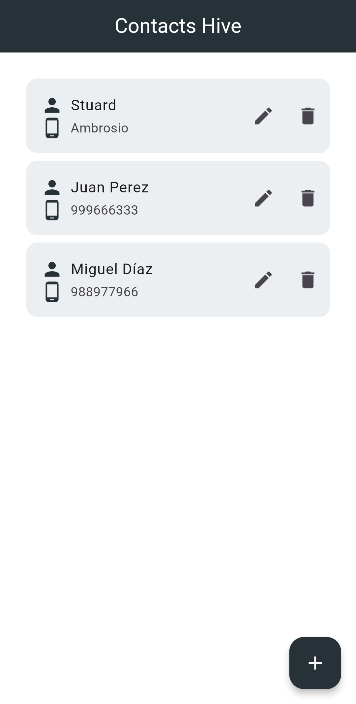
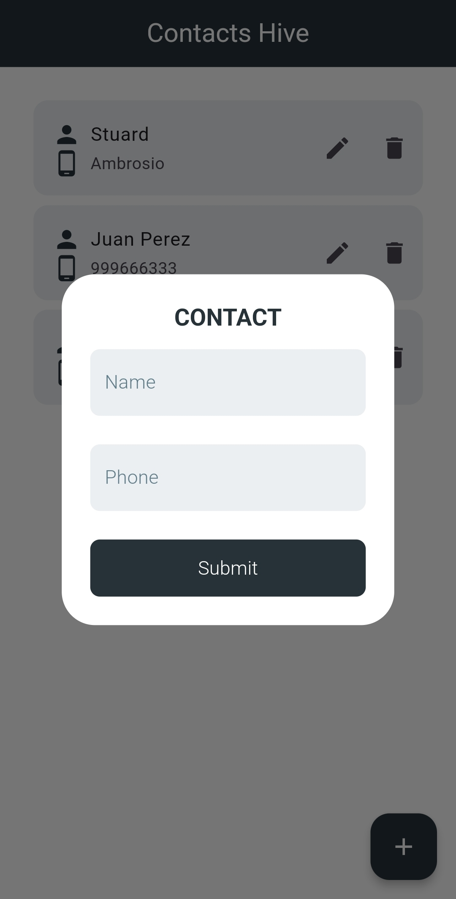

# Flutter Contacts App

A simple contacts application developed with Flutter that uses **Hive** as local database, **GetIt** for dependency injection, **Bloc** for state management and follows the Clean Architecture.

## Features

- Create, read, update and delete contacts.
- Store contacts locally using the **Hive** database.
- Handles dependency injection with **GetIt**.
- Uses the Bloc pattern for state management.
- Clean architecture for better code organization and scalability.

## Requirements

- Flutter SDK
- Dart
- Hive
- Hive_flutter
- GetIt
- Flutter_bloc
- Equatable (optional, for equal states in Bloc)

## Screenshots

